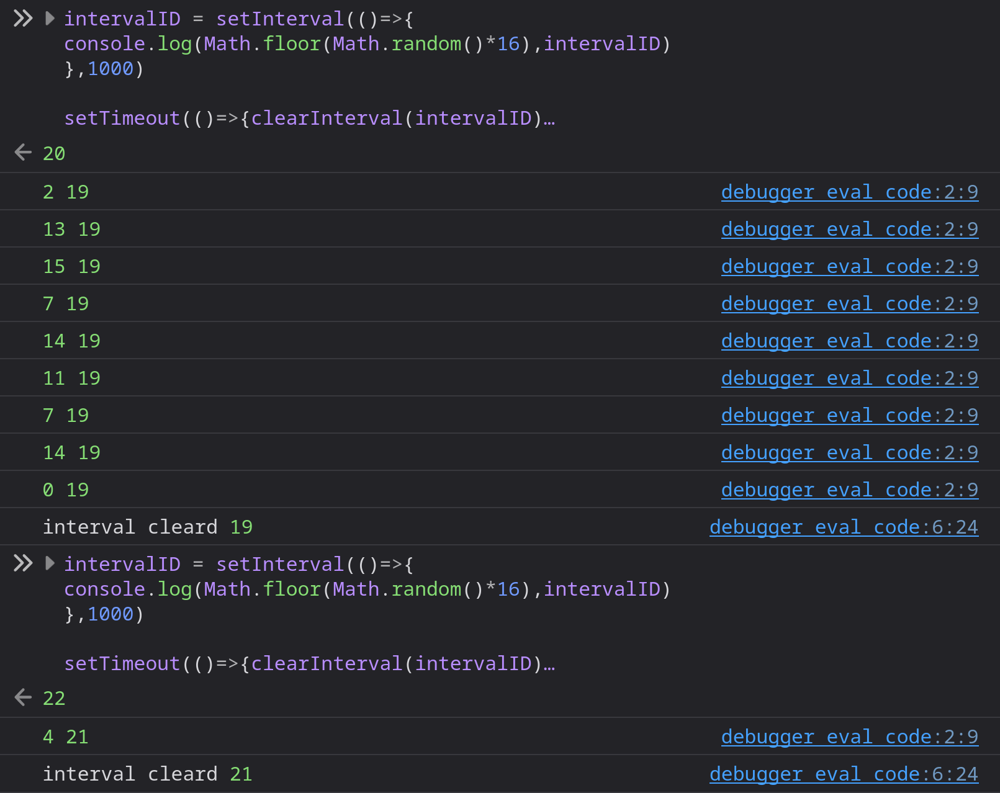

## Digital clock Bash Script
```bash
#!/bin/bash

clear
while true; do
    clear
    echo -e "\n\n\t\t$(date +"%H:%M:%S")"
    sleep 1
done
```
# Why
```javaScript
intervalID = setInterval(()=>{
console.log(Math.floor(Math.random()*16),intervalID)
},1000)

setTimeout(()=>{clearInterval(intervalID)
               console.log('interval cleard', intervalID)},1000)
```



